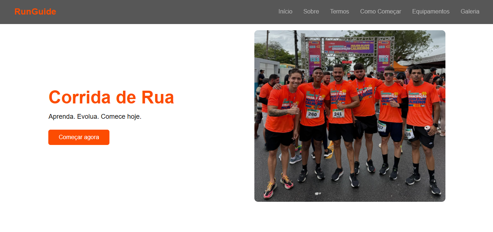
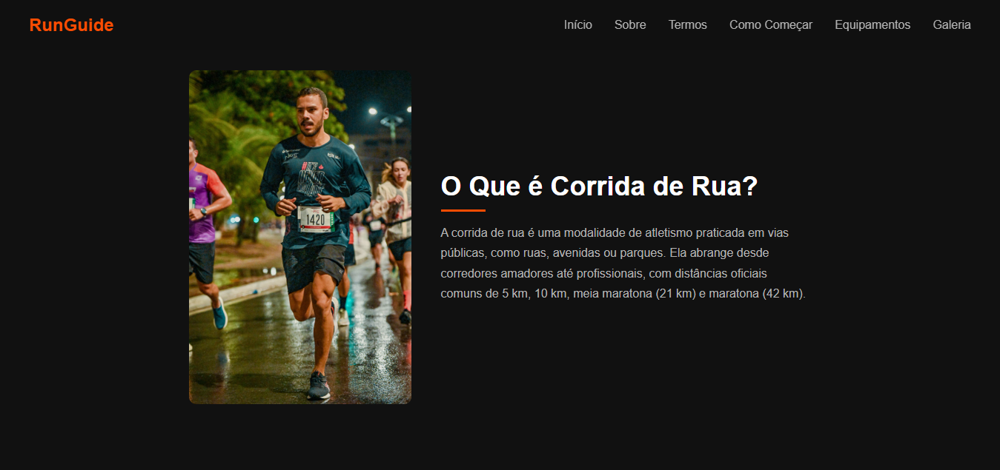
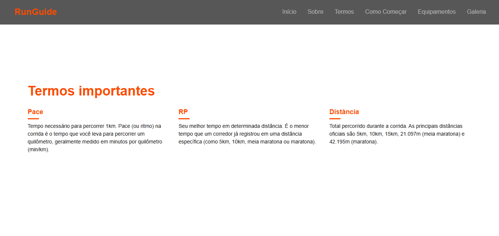
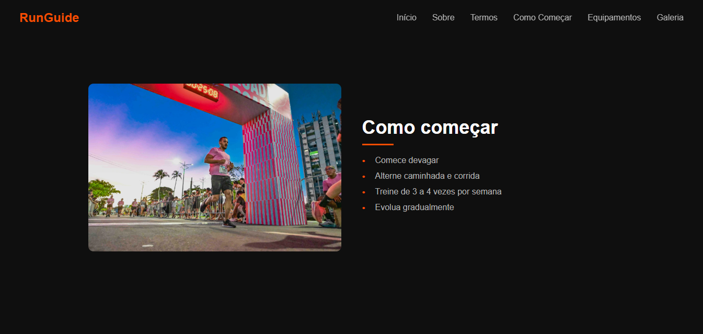
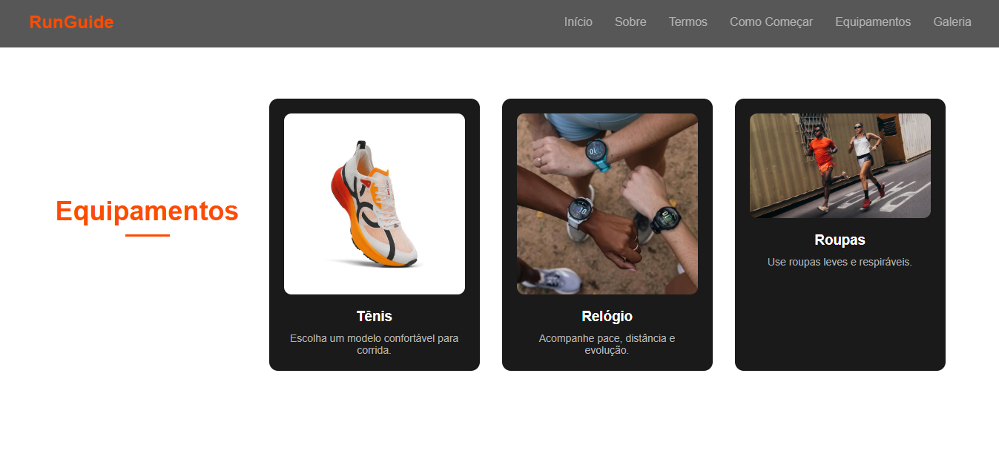
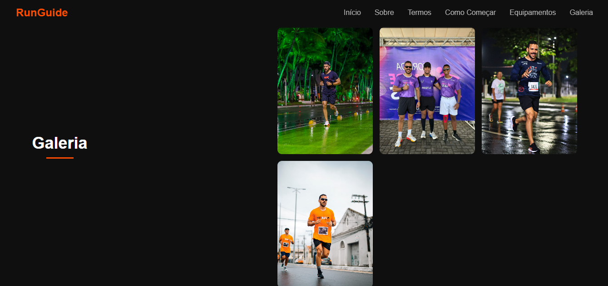

# 🏃‍♂️ Landing Page - Corrida

Uma landing page moderna sobre corrida de rua, desenvolvida com foco em design, organização de layout e experiência do usuário.

---

## 🚀 Tecnologias utilizadas

- HTML5  
- CSS3  

---

## 🎯 Funcionalidades

- Layout moderno estilo marca esportiva  
- Seções informativas sobre corrida  
- Explicação de termos importantes (Pace, RP, etc.)  
- Guia para iniciantes  
- Seção de equipamentos  
- Galeria de imagens  
- Footer com informações finais  

---

## 💡 Objetivo do projeto

Este projeto foi desenvolvido com o objetivo de praticar:

- Estruturação de páginas com HTML  
- Estilização com CSS
- Organização de layout profissional  
- Boas práticas de desenvolvimento front-end  

---

## ⚠️ Melhorias futuras

- 📱 Responsividade (em desenvolvimento)   
- 🌐 Deploy do projeto  

---

## 📸 Preview

### 🏠 Hero (Página inicial)
Seção principal com destaque visual:

---

### 🧠 Seção Sobre
Explicação sobre a corrida de rua:

---

### 📊 Termos importantes
Cards explicando conceitos como Pace, RP e Distância:

---

### 🏃 Como começar
Guia simples para iniciantes na corrida:

---

### 👟 Equipamentos
Sugestões de itens essenciais para começar a correr:

---

### 🖼️ Galeria
Imagens relacionadas a corrida:

---

## 👨‍💻 Autor

Leonardo Nascimento  